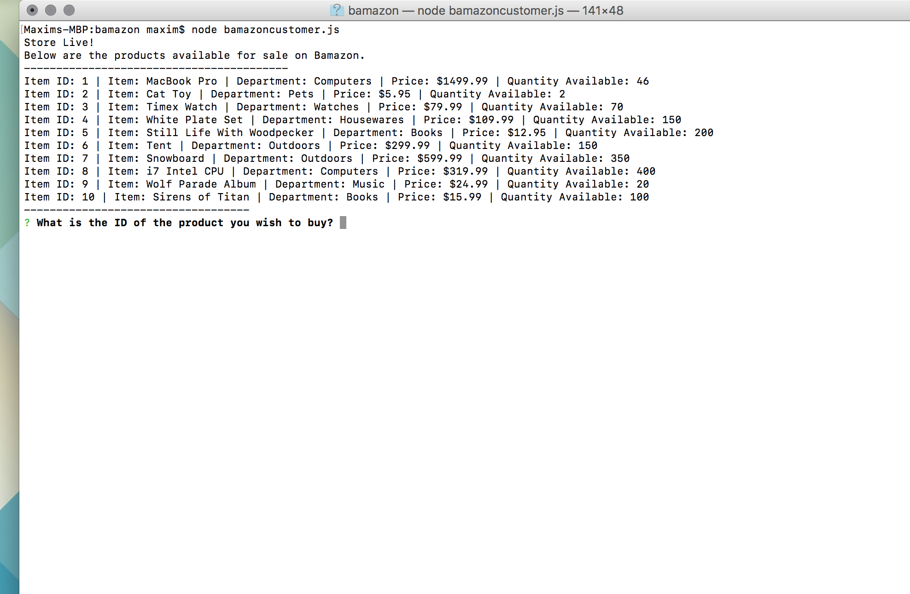
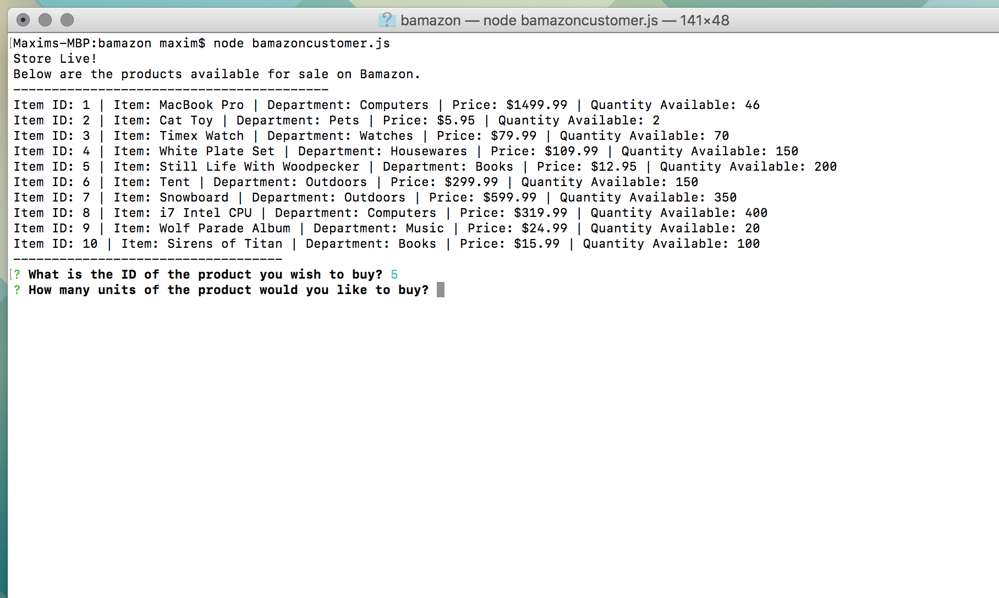
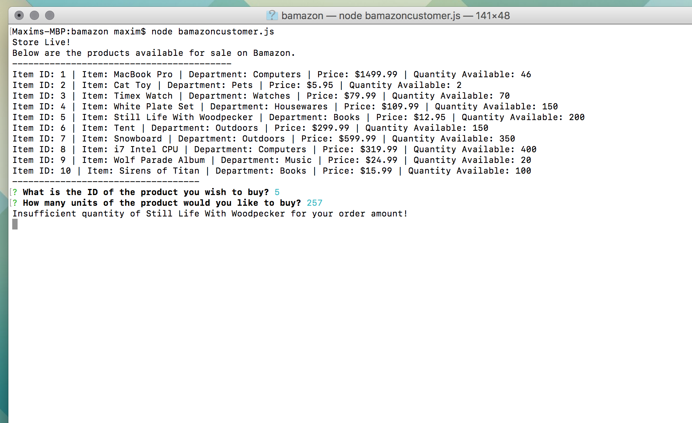
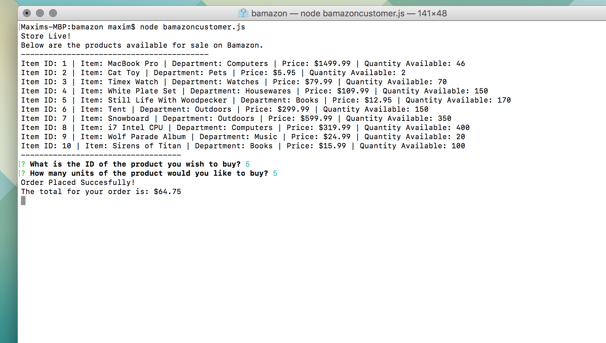
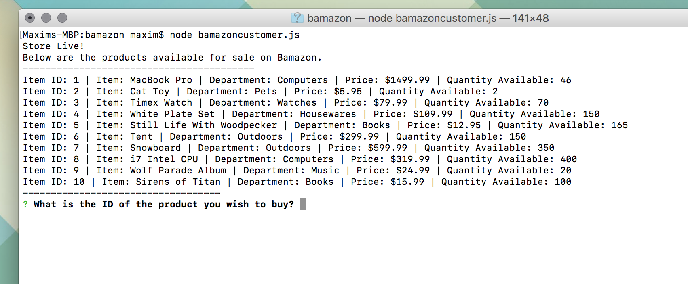

# Bamazon App By Max

## Purpose

This `README.md` will describe the operations of the Node application called `bamazonCustomer.js`. This application simulates a command line shopping experience.

This is a CLI App.

Screenshots will be used to describe the user flow through the application.

### Bamazon Customer

* Upon the launch of the `bamazonCustomer.js` application the user will receive a display of the products available from Bamazom. These products are located in the `bamazon_db.sql` database.

Below the items listed, the user receives their first actionable prompt:

* ###### What is the ID of the product you wish to buy?

When the user successfully chooses an amount for the item, a secondary prompt will appear.

* ###### How many units of the product would you like to buy?

If the user enters a product quantity that is higher than the "quantity available" listed than an error prompt will appear.

* ###### Insufficient quantity of "product" for your order amount!

If the user enters an an order amount for a given item that is appropriate then the order will be fulfilled and they will receive an update with the total cost of their order.

* ###### Successful Order / Final Order Price Updated

After a succesful order, the `bamazon_db.sql` will be updated to remove the order items from the product table.

* ###### Product Quantity Updated in DATABASE

